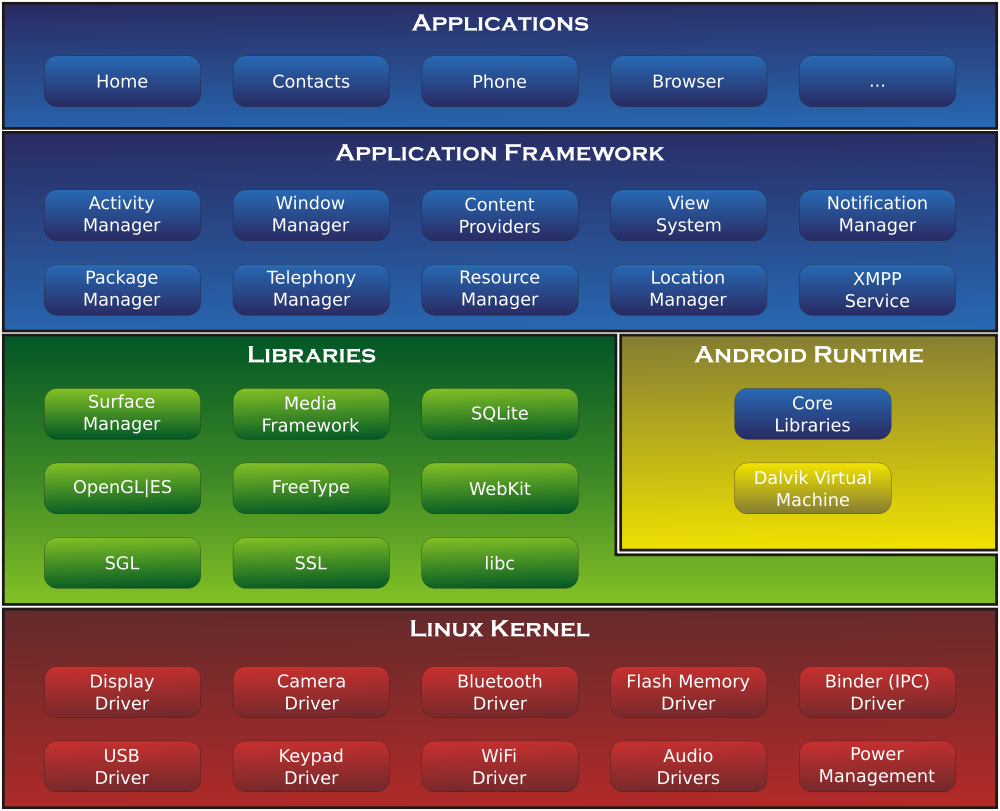
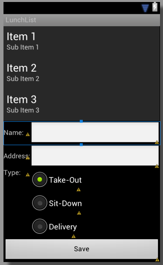

!SLIDE

# Android Workshop
## Torino, Febbraio 2013
### Michelangelo Altamore

!NOTE

Primo giorno

1. Android OS
2. Architettura OS
3. Applicazioni
4. Sicurezza
5. Condivisione dei dati
6. Componenti Applicativi
7. Activity
8. Service
9. Content Provider
10. Broadcast Receiver
11. Attivazione Componenti
12. Intents


!SLIDE left

# Installazione software

 1. [Installare Android SDK](https://developer.android.com/sdk/index.html)
 2. [Installare Eclipse IDE](https://www.eclipse.org/downloads/packages/eclipse-mobile-developers/junosr1)
 3. [Installare Android Developer Tools](https://developer.android.com/sdk/installing/installing-adt.html)
 4. [Esempi Android da scaricare](https://github.com/commonsguy/cw-lunchlist/archive/master.zip)


!SLIDE left

# Links da consultare

* [Android Package Reference](https://developer.android.com/reference/packages.html)
* [Official API Guides](https://developer.android.com/guide/components/index.html)


!SLIDE left

# Overview dell'OS

* Android e' basato su un kernel Linux
* middleware, librerie e le API sono scritte in C
* le applicazioni girano su un framework applicativo che include librerie compatibili con Java basate su Apache Harmony.
* Android usa la Dalvik Virtual Machine con una compilazione JIT per eseguire Dalvik _dex-code_, che viene generalmente tradotto dal byte-code Java.
* La principale piattaforma hardware e' l'architettura ARM.


!SLIDE left

# Architettura di Android




!SLIDE left

# Applicazioni Android

* sono scritte nel linguaggio di programmazione Java
* gli SDK Android consentono di compilare il codice, insieme a tutti i dati e le risorse in un pacchetto Android, un file di archivio con un suffisso `.apk` avente tutto il codice in un unico file
* un Apk è considerato una sola applicazione ed e' il file che i dispositivi Android utilizzano per installare l'applicazione


!SLIDE left

# Sicurezza

Una volta installata su un dispositivo, ogni applicazione Android vive nella propria sandbox di sicurezza:

* il sistema operativo Android è un sistema multi-utente Linux in cui ogni applicazione è un utente diverso
* per impostazione predefinita, il sistema assegna ad ogni applicazione un unico ID utente Linux (l'ID è utilizzato solo dal sistema e non è noto all'utente)


!SLIDE left

# Sicurezza (2)

* il sistema imposta le autorizzazioni per tutti i file di un'applicazione in modo che solo l'ID utente assegnato a tale applicazione possa accedervi.

* ogni processo ha la propria macchina virtuale (VM), per cui il codice dell'applicazione viene eseguito in isolamento da altre applicazioni.

* per default ogni applicazione viene eseguita in un proprio processo Linux. 

* Android inizia il processo quando uno dei componenti dell'applicazione deve essere eseguito, spegne il processo quando non è più necessario o quando il sistema deve recuperare la memoria per altre applicazioni.


!SLIDE left

# Condivisione Dati

per condividere i dati con altre applicazioni e per accedere a servizi di sistema:

* due applicazioni possono condividere lo stesso ID utente di Linux, nel qual caso esse sono in grado di accedere ai file degli altri. Per risparmiare risorse di sistema, le applicazioni con lo stesso ID utente possono anche girare nello stesso processo Linux e condividere la stessa VM (le applicazioni devono essere firmate con lo stesso certificato).

* un'applicazione può richiedere il permesso di accedere ai dati del dispositivo come ad esempio i contatti dell'utente, messaggi SMS, la memoria di massa (SD card), fotocamera, Bluetooth, e altro ancora.

le autorizzazioni di applicazione devono essere concesse dall'utente al momento dell'installazione.


!SLIDE left

# Componenti Applicativi

* sono le componenti essenziali di un'applicazione Android. 
* ogni componente è un punto diverso attraverso cui il sistema può entrare nell'applicazione. 
* non tutti i componenti sono punti di ingresso reali per l'utente e alcuni dipendono l'uno dall'altro, ma ognuno esiste come entità e svolge un ruolo specifico
* ogni componente è un elemento unico che serve a definire il comportamento generale dell'applicazione.


!SLIDE left

# Componenti Applicativi

Ci sono quattro diversi tipi di componenti. Ogni tipo ha uno scopo distinto ed ha un ciclo di vita diverso che definisce come il componente viene creato e distrutto.

1. Activity
2. Service
3. Content Provider
4. Broadcast Receiver


!SLIDE left

# Activity

* rappresenta una singola schermata con un'interfaccia utente
* e' una singola cosa che l'utente puo' fare
* interagisce con l'utente
* presenta all'utente una finestra nella quale posizionare gli elementi della UI

Esempio: un'applicazione di posta elettronica potrebbe avere una attività che mostra un elenco di nuove email, un'altra attività per comporre una e-mail, e un'altra attività di lettura delle email. Sebbene le attività lavorano insieme per formare un'esperienza utente coerente nell'applicazione di posta elettronica, ognuna è indipendente dalle altre. In questo modo, una diversa applicazione può attivare una qualsiasi di queste attività (se permesso dal programma di posta elettronica).


!SLIDE left

# Service

* e' un componente che viene eseguito in background per eseguire operazioni di lunga durata o svolgere attività per processi remoti.

* non fornisce un'interfaccia utente.

Esempio: un servizio può riprodurre musica in background mentre l'utente è in un'altra applicazione, oppure potrebbe recuperare i dati attraverso la rete senza bloccare l'interazione dell'utente con una determinata attività.


!SLIDE left

# Content Provider

* gestisce un insieme condiviso di dati delle applicazioni
* puo' memorizzare dati nel file system, un database SQLite, sul web, o qualsiasi altro luogo di memorizzazione persistente l'applicazione può accedere
* tramite esso altre applicazioni possono interrogare o anche modificare i dati

Esempio: Android fornisce un Content Provider che gestisce le informazioni di contatto dell'utente. Come tale, tutte le applicazioni con le autorizzazioni appropriate possono interrogare parte del Content Provider (come ad esempio ContactsContract.Data) per leggere e scrivere informazioni su una persona particolare.


!SLIDE left

# Broadcast Receiver

* e' un componente che risponde ad annunci broadcast a livello di sistema

* molti annunci provengono dal sistema operativo, ad esempio, un evento che annuncia che lo schermo è spento, la batteria è scarica, o una foto è stata catturata.

* ma anche le applicazioni possono anche avviare tramissione di annunci ad esempio, per consentire altre applicazioni sapere che alcuni dati sono stati scaricati nel dispositivo e sono disponibili per l'uso

Anche se non visualizzano un'interfaccia utente, possono creare una notifica sulla barra di stato per avvisare l'utente


!SLIDE left

# Attivazione Componenti

Un aspetto unico di Android è che qualsiasi applicazione può aprire un componente di un'altra.

Esempio: in un'applicazione si desidera che l'utente scatti una foto con la fotocamera del dispositivo.

* Probabilmente c'e' gia' un'altra applicazione che lo fa
* L'applicazione la può quindi usare, piuttosto di sviluppare un'activity specifica

Non c'e' bisogno di integrare o collegare il codice dell'applicazione della fotocamera. Al contrario, si può semplicemente avviare l'attività nell'applicazione della fotocamera che cattura una foto. Al termine, la foto è anche restituita alla propria applicazione in modo da essere utilizzata. All'utente appare che la sezione di scatto fotografia della fotocamera sia in realtà parte integrante dell'applicazione.


!SLIDE left

# Attivazione Componenti

Quando nel sistema si avvia un componente, inizia il processo per l'applicazione (se non è già in esecuzione) e si istanziano le classi necessarie per il componente.

Poiché il sistema esegue ogni applicazione in un processo separato con i permessi dei file che limitano l'accesso ad altre applicazioni, l'applicazione non può direttamente attivare un componente da un'altra applicazione. 

Il sistema Android, tuttavia, può, quindi, per attivare un componente in un'altra applicazione, basta consegnare un messaggio al sistema che indica l'_Intent_ di avviare un particolare componente.


!SLIDE left

# Intents

* sono messaggi asincroni che consentono ad Android di richiedere funzionalita' da altri
componenti del sistema Android.

* Esempio: un'Activity puo' inviare un'Intent ad Android al fine di fare partire un'altra Activity

* Quindi gli Intent consentono di combinare componenti debolmente accoppiati per eseguire certe operazioni.


!SLIDE left

# Intents

* possono essere usati per segnalare al sistema Android che e' occorso un certo evento

* altri componenti in Android possono registrare quell'evento ed essere notificati

* gli Intent sono istanze della classe `android.content.Intent`


!SLIDE left

# Intents

* possono contenere dati, questi dati possono essere usati dal componente che riceve l'Intent

Esempio: un'applicazione chiama il componente browser tramite un'intent, l'Intent puo' contenere come dati l'URL con cui si vuole che si apra il componente.

* Android supporta Intent espliciti ed impliciti

!NOTE

Secondo giorno

1. Struttura Applicazioni
2. Manifest Android
3. Directories di progetto
4. Ciclo di vita di un'Activity
5. Attributi
6. Riferimenti alle View
7. Attributi
8. Layouts

!SLIDE left

# Esercitazione 1

1. creare un emulatore su android
2. creare un nuovo progetto android da Eclipse
3. deployare il progetto sull'emulatore


!SLIDE left

# Struttura Applicazioni

In un progetto Android e' presente un *Manifest*

* che elenca i componenti disponibili nell'applicazione
* un componente principale, l'_entry point_ dell'applicazione


!SLIDE left

# Manifest Android

`AndroidManifest.xml`
``` xml
<?xml version="1.0" encoding="utf-8"?>
<manifest xmlns:android="http://schemas.android.com/apk/res/android"
package="com.example.exampleandroid"
android:versionCode="1"
android:versionName="1.0" >

	<uses-sdk
	android:minSdkVersion="8"
	android:targetSdkVersion="16" />

	<application
	android:allowBackup="true"
	android:icon="@drawable/ic_launcher"
	android:label="@string/app_name"
	android:theme="@style/AppTheme" >
		<activity
		android:name="com.example.exampleandroid.MainActivity"
		android:label="@string/app_name" >
			<intent-filter>
				<action android:name="android.intent.action.MAIN" />
				<category android:name="android.intent.category.LAUNCHER" />
			</intent-filter>
		</activity>
	</application>
</manifest>
```


!SLIDE left

# Directories di Progetto

	MyAndroidProject
	|-bin
	|-gen
	|-assets
	|-res
	|---drawable-hdpi
	|---drawable-ldpi
	|---drawable-mdpi
	|---drawable-xhdpi
	|---layout
	|---values
	\-src


!SLIDE left

# Activity

* rappresenta una singola schermata con una interfaccia utente
* e' una singola cosa che l'utente puo' fare
* interagisce con l'utente
* presenta all'utente una finestra nella quale posizionare gli elementi della UI


!SLIDE

[Ciclo di vita di un'activity](https://developer.android.com/images/activity_lifecycle.png)


!SLIDE left

# Esercitazione 2

* Da Eclipse: New.. | Project | Android Project From Existing Code

* `cw-lunchlist-master/02-SimpleForm`

!SLIDE left

# Creazione di un'Activity

`onCreate(Bundle)`
``` java
@Override
public void onCreate(Bundle savedInstanceState) {
	super.onCreate(savedInstanceState);
	setContentView(R.layout.main);

	Button save=(Button)findViewById(R.id.save);

	save.setOnClickListener(onSave);
}

private View.OnClickListener onSave=new View.OnClickListener() {
	public void onClick(View v) {
		EditText name=(EditText)findViewById(R.id.name);
		EditText address=(EditText)findViewById(R.id.addr);

		r.setName(name.getText().toString());
		r.setAddress(address.getText().toString());
	}
};
```


`res/layout/main.xml`
``` xml
<?xml version="1.0" encoding="utf-8"?>
<LinearLayout xmlns:android="http://schemas.android.com/apk/res/android"
android:orientation="vertical"
android:layout_width="match_parent"
android:layout_height="match_parent">
...
<Button
android:id="@+id/save"
android:layout_width="match_parent"
android:layout_height="wrap_content"
android:text="@string/save_button" />
</LinearLayout>

```

!SLIDE left

# Una view in Android

* viene creata da un _layout_ che viene caricato e mostrato dall'Activity
* ci sono diversi tipi di _layout_, ad es.: `LinearLayout`, `RelativeLayout`, `TableLayout`...
* in genere un layout contiene elementi della User Interface


!SLIDE left

# Rinomina progetto

* in Eclipse selezionare il progetto `LunchList`
* sul menu contestuale, selezionare: Refactor | Rename
* rinominare `LunchList_02` <p style="display:none">_</p>

!SLIDE left

# Esercitazione 3

* Da Eclipse: New.. | Project | Android Project From Existing Code

* `cw-lunchlist-master/03-FancierForm`


!SLIDE


# Esempio di Layout

``` xml
<?xml version="1.0" encoding="utf-8"?>
<RelativeLayout xmlns:android="http://schemas.android.com/apk/res/android"
android:layout_width="match_parent"
android:layout_height="match_parent"
>            
	<TableLayout android:id="@+id/details"
	android:layout_width="match_parent"
	android:layout_height="wrap_content"
	android:layout_alignParentBottom="true"
	android:stretchColumns="1"
	android:shrinkColumns="1"
	>
		<TableRow>
			<TextView android:text="Name:" />
			<EditText android:id="@+id/name" />
		</TableRow>
		<TableRow>
			<TextView android:text="Address:" />
			<EditText android:id="@+id/addr" />
		</TableRow>
		<TableRow>
			<TextView android:text="Type:" />
			<RadioGroup android:id="@+id/types">
				<RadioButton android:id="@+id/take_out"
				android:text="Take-Out"
				android:checked="true"
				/>
				<RadioButton android:id="@+id/sit_down"
				android:text="Sit-Down"
				/>
				<RadioButton android:id="@+id/delivery"
				android:text="Delivery"
				/>
			</RadioGroup>
		</TableRow>
		<Button android:id="@+id/save"
		android:layout_width="match_parent"
		android:layout_height="wrap_content"
		android:text="Save"
		/>
	</TableLayout>
	<ListView android:id="@+id/restaurants"
	android:layout_width="match_parent"
	android:layout_height="wrap_content"
	android:layout_alignParentTop="true"
	android:layout_above="@id/details"
	/>
</RelativeLayout>
```

!SLIDE




!SLIDE left

# Caricamento XML

Quando viene compilata l'applicazione, ogni layout viene compilato in una View

Si carica la risorsa di layout dal codice applicativo, nella  callback `Activity.onCreate()`
chiamando `setContentView()` passando il riferimento alla risorsa di layout nella forma
`R.layout.<nome_layout>`

Esempio:
``` java
public void onCreate(Bundle savedInstanceState) {
    super.onCreate(savedInstanceState);
    setContentView(R.layout.main_layout);
}
```

!SLIDE left

# Attributi

Ogni `View` e `ViewGroup` supporta il proprio insieme di attributi XML

* Alcuni sono specifici ad un _View object_ (esempio: `TextView` supporta l'attributo `textSize`)
* Altri sono comuni a tutti (esempio: l'attributo `id`)
* Altri ancora sono considerati _parametri di layout_ (esempio: orientazione del layout)

!SLIDE left

# Attributo ID

Qualsiasi oggetto `View` puo' avere un ID associato ad esso per identificare univocamente l'oggetto

Quando l'applicazione viene compilata, questo ID e' referenziato come un intero, ma tipicamente viene assegnato nel layout XML come una stringa.

Ecco la sintassi:

    android:id="@+id/my_button"


!SLIDE left

# Attributi ID

Il simbolo `@` indica che il parser XML dovrebbe espandere la stringa dopo lo slash ed identificarla come un ID intero.
Il simbolo `+` significa che si tratta di una nuova risorsa che deve essere creata e aggiunta al file di risorse `R.java`

Per le risorse che fanno riferimento ad elementi di Android non c'e' bisogno del simbolo `+` e possono essere referenziate con questa sintassi:

    android:label="@string/app_name"


!SLIDE left

# Riferimenti alle View

Per creare view e ottenerne un riferimento dall'applicazione, un pattern seguito e':

1. Definire la view assegnando un unico ID
``` xml
<Button android:id="@+id/my_button"
        android:layout_width="wrap_content"
        android:layout_height="wrap_content"
        android:text="@string/my_button_text"/>
```

2. Creare un'istanza dell'oggetto e ottenerne un riferimento (sull'`onCreate()` in genere)
``` java
    Button myButton = (Button) findViewById(R.id.my_button);
```

!SLIDE left

# Parametri di Layout

Gli attributi di layout XML che si chiamano `layout_<nome_parametro>` definiscono parametri per il layout della `View` relativa al `ViewGroup` nel quale risiede.

Ogni `ViewGroup` implementa una _nested class_ che estende `ViewGroup.LayoutParams`.

Tale sottoclasse contiene tipi di proprieta' che definiscono dimensioni e posizione di ciascuna
view figlia cosi' come definito dalla `ViewGroup`

!SLIDE left


!SLIDE left

# Layouts tipici

Ogni sottoclasse di `ViewGroup` fornisce una modalita' di visualizzazione delle viste in
essa contenute.

Ecco alcuni esempi di `ViewGroup`

* LinearLayout: dispone i propri figli su di una singola riga, orizzontale o verticale
* RelativeLayout: consente di specificare la posizione delle view figlie in relazione tra loro (A alla sx di B) o della view genitore
* WebView: mostra pagine web


!SLIDE left

# Rinomina progetto

* in Eclipse selezionare il progetto `LunchList`
* sul menu contestuale, selezionare: Refactor | Rename
* rinominare `LunchList_03`


!SLIDE left

# Esercitazione 4

* Da Eclipse: New.. | Project | Android Project From Existing Code

* `cw-lunchlist-master/04-ListView`


!SLIDE left

# Adapters

Un adapter fornisce un'interfaccia comune al data model sottostante ai
widget di selezione come un ListBox.

Gli adapter di Android sono responsabili dell'elenco dei dati per un
widget di selezione oltre a convertire individuali elementi di dato in
view specifiche che vengono mostrate dentro il widget di selezione.


!SLIDE

``` java
class RestaurantAdapter extends ArrayAdapter<Restaurant> {
	RestaurantAdapter() {
		super(LunchList.this, R.layout.row, model);
	}

	public View getView(int position, View convertView,
			ViewGroup parent) {
		View row=convertView;
		RestaurantHolder holder=null;

		if (row==null) {
			LayoutInflater inflater=getLayoutInflater();

			row=inflater.inflate(R.layout.row, parent, false);
			holder=new RestaurantHolder(row);
			row.setTag(holder);
		}
		else {
			holder=(RestaurantHolder)row.getTag();
		}

		holder.populateFrom(model.get(position));

		return(row);
	}
}
```


!SLIDE left

# Rinomina progetto

* in Eclipse selezionare il progetto `LunchList`
* sul menu contestuale, selezionare: Refactor | Rename
* rinominare `LunchList_04` <p style="display:none">_</p>

!SLIDE left

# Esercitazione 5

* Da Eclipse: New.. | Project | Android Project From Existing Code

* `cw-lunchlist-master/05-FancyList`


